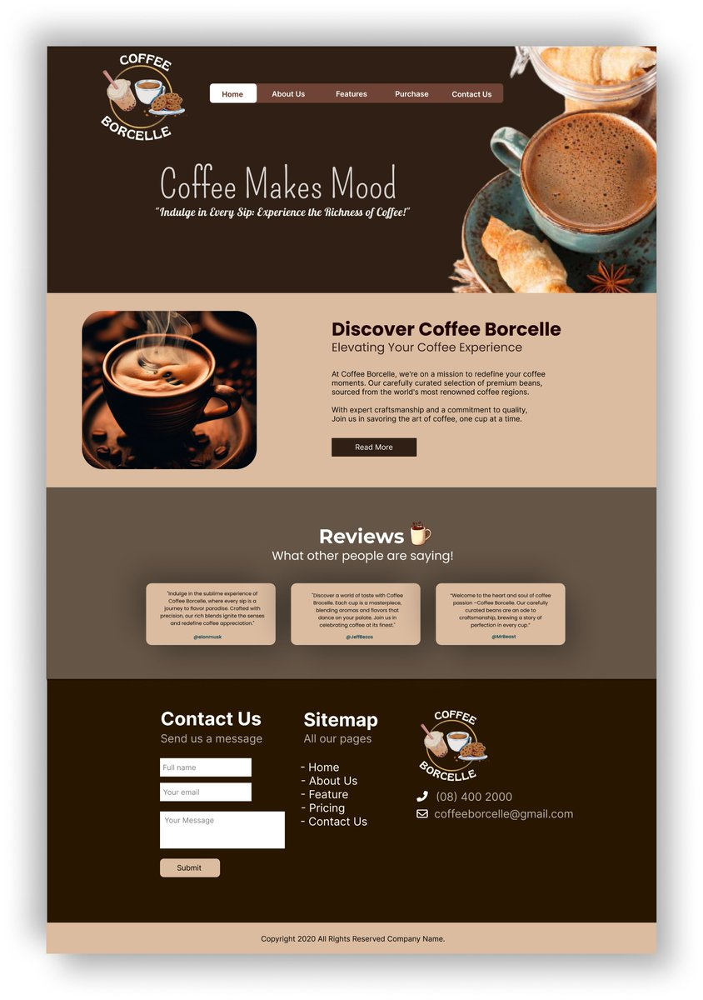

# COFFEE BORCELLE Website

## Introduction

Hello! Welcome to COFFEE BORCELLE, your ultimate destination for a premium coffee experience. I'm excited to share with you the journey of discovering exquisite coffee blends and accessories. You can find me on Twitter as [@Son_Of_Anton](https://twitter.com/bazuking2) and on GitHub as [@7442charles](https://github.com/7442charles).

Stay tuned for updates on the world of coffee!

## About the Website

The COFFEE BORCELLE website is your gateway to the world of premium coffee. Designed to provide a seamless browsing experience, it showcases our finest coffee beans, accessories, and brewing equipment. Whether you're a coffee connoisseur or a casual enthusiast, there's something here for everyone.

## Original Design

The design inspiration for the COFFEE BORCELLE website draws from the creative vision of Amena Sabuwala, whose work can be found on Twitter at [@AmenaiSabuwala](https://twitter.com/AmenaiSabuwala).

*Credit: Design by Amena Sabuwala ([@AmenaiSabuwala](https://twitter.com/AmenaiSabuwala))*

## Features

- **Sleek Design**: A modern and elegant interface to elevate your coffee shopping experience.
- **Responsive Layout**: Optimized for various devices, ensuring seamless browsing on desktop, tablet, and mobile.
- **Social Media Integration**: Connect with us on social media and share your coffee journey with the world.

## Technologies Used

- HTML5
- CSS3
- JavaScript

## Getting Started

To explore the COFFEE BORCELLE website, follow these simple steps:

1. Clone this repository to your local machine.
2. Open the `index.html` file in your web browser.

## Contributing

We welcome contributions to enhance the COFFEE BORCELLE experience! If you have ideas for improvement or would like to report an issue, please feel free to submit a pull request or open an issue on GitHub.

